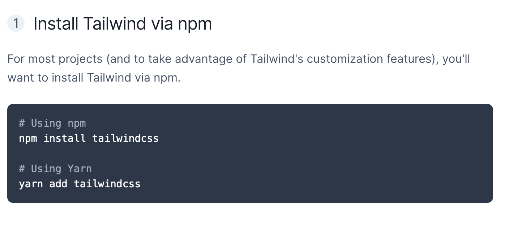
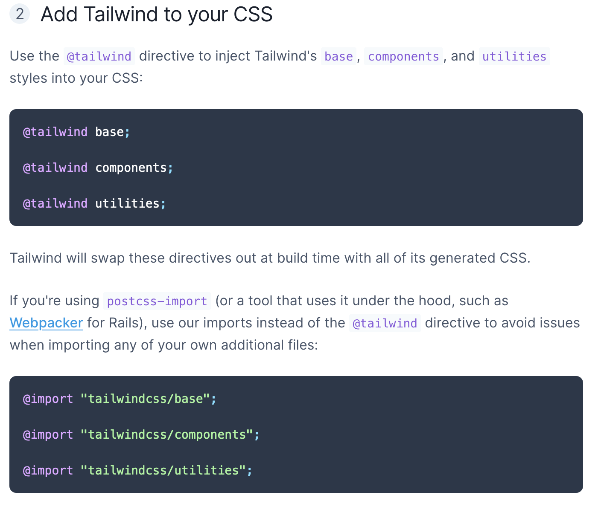
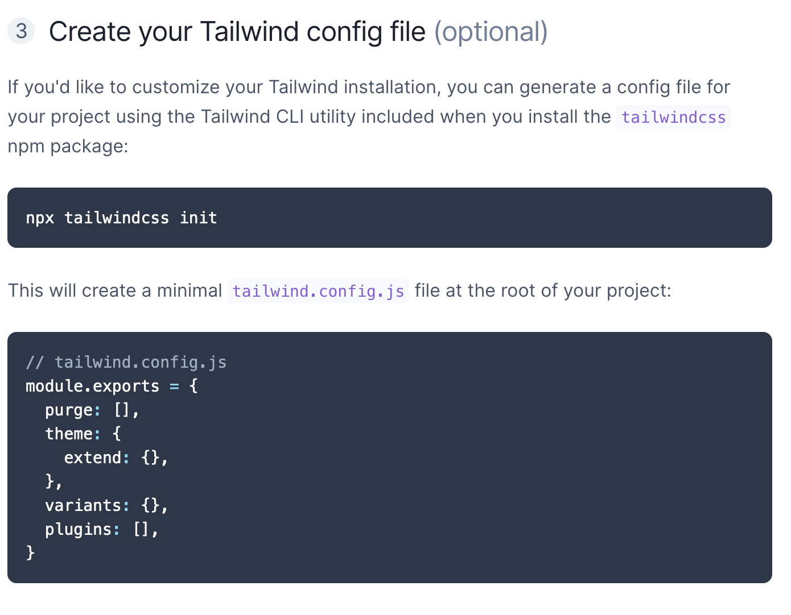
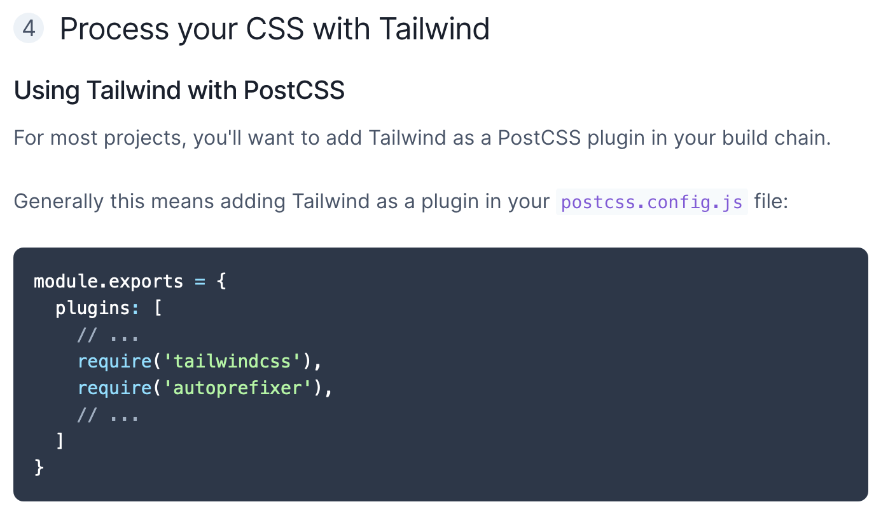
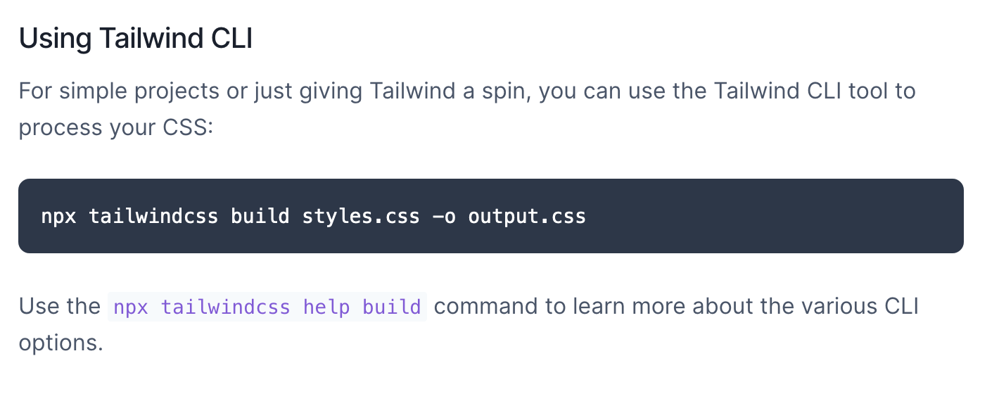

React Native: Aplicaciones nativas para IOS y Android
====

React Native
-------
- EXPO CLI
    Correr App IOS - Android 
    
- Recat Native CLI 
    Crear proyecto con recursos minimos 
    Carpeta de IOS - Android 

Secciones Curso React Native
-------
# Seccion 4 - Counter App
  - En esta sección veremos temas sobre:
    - Hola Mundo en React Native
    - Cambios en el State
    - Contador
    - Re-utilización de componentes
    - Pantallas
    - Componentes personalizados
    - Stylesheet
    - Envío de argumentos a componentes
    - Tipando props
    - Componentes como:
        - View
        - Text
        - TouchableOpacity
        - TouchableNativeFeedback
        - TouchableWithoutFeedback

# Seccion 5 - Flex, Position y Box Object Model
  - En esta sección nos enfocaremos principalmente en comprender los 3 bloques principales para el diseño de aplicaciones en React Native:
    - Box Object Model
    - Position
    - Flex Layout

# Seccion 6 - Aplicación - Calculadora de IOS
  - Esta sección es nuestra primera aplicación oficial en React Native, crearemos una calculadora que use componentes re-utilizables, custom hooks, cálculos matemáticos y estilo Flex para lograr el aspecto visual deseado.
    - Puntualmente veremos:
      - Flex layout
      - useState
      - useRef
      - useCalculadora - Custom Hook
      - View
      - SafeAreaView
      - Text
      - StyleSheets

Configuracion en Github
-------

- Configuracion Hostinger - GitHub
    https://support.hostinger.es/es/articles/2642602-puedo-implementar-un-repositorio-git

- Configurar PHP 
    https://www.solvetic.com/tutoriales/article/9121-como-instalar-php-7-4-en-windows-10/

  …or create a new repository on the command line
  echo "# course-RN-MV" >> README.md
  git init
  git add README.md
  git commit -m "first commit"
  git branch -M main
  git remote add origin https://github.com/AustinAMTZ16/course-RN-MV.git
  git push -u origin main
  …or push an existing repository from the command line
  git remote add origin https://github.com/AustinAMTZ16/course-RN-MV.git
  git branch -M main
  git push -u origin main
  …or import code from another repository
  You can initialize this repository with code from a Subversion, Mercurial, or TFS project.

  Uso README.md en Github
  -------
  [![Uso README.md en Github]](https://programmerclick.com/article/16331423290/)  

# Seccion 7 - Tipos de Navegación APP 
  - Aquí empezaremos con el Stack y Drawer navigation, comprender cada uno de los diferentes controles de navegaciones es una pieza fundamental el cualquier aplicación móvil, por lo que procuremos aprender cada uno de ellos para poderlos mezclar y lograr el objetivo que tenemos para nuestra aplicación.
    - Stack Navigation.- Logica va poniendo view ensima de otro 
    - Drawer Navigation.- Logica por en lases Drawer 
    - BottomTab Navigation
    - MaterialTop Navigation

# Seccion 8 - Tipos de Navegación APP & Material TOP Scrollable Tabs
  - En esta sección aprenderemos tres temas muy importantes que son:
    - Tabs
    - TopTaps con scroll
    - Iconos

# Seccion 9 - Context y estados global de la aplicacion [sección importante]
  - El objetivo de esta sección, es aprender cómo comunicar los componentes entre sí, sin importar su ubicación en el árbol de componentes.
  - Aprenderemos a colocar el tipado a todo y usar el context para poder renderizar nuevamente los componentes cuando surjan cambios.

# Seccion 10 - Aplicación de Películas
  - Puntualmente:
    - Axios
    - Custom Hooks aplicados a la realidad
    - Loadings
    - Promesas simultáneas @
    - Carousels

# Seccion 11 - Gradiente animado - ConextAPI
  - Puntualmente aprenderemos:
    -  ContextAPI
    -  Global State
    -  Extraer colores de las imágenes
    -  Funciones helper
# Seccion 12 - Componentes de ReactNative
  - En esta sección vamos a trabajar con muchos componentes de React Native y su personalización, el objetivo es que aprendamos sus detalles y cómo seguir expandiendo nuestro conocimiento de la mano de la documentación.

    - Aquí veremos entre otros temas:
      - Animaciones
      - FlatLists
      - Normales
      - Agrupadas
      - Modals
      - Alertas
      - Switches
      - TextInputs
      - Teclados
      - Imágenes
      - FadeInImage

# Título de primer nivel
 ## Título secundario
 ### Encabezado de tres niveles
 #### Encabezado de cuatro niveles
 ##### Encabezado de cinco niveles
 ###### Título de sexto nivel

 * Lista uno
 * Lista dos
 * Lista tres

 > Sangría uno
 >> Sangría dos
 >>> Sangría tres
 >>>> Sangría cuatro
 >>>>> Sangría cinco

[![baidu]](https://programmerclick.com/article/16331423290/)  
[baidu]: http: //www.baidu.com/img/bdlogo.gif "Logotipo de Baidu"  

Pruebas
-------

<!-- PROJECT SHIELDS -->

<!-- PROJECT LOGO -->
 

  

  <h3 align="center"><strong>Writer's Block</strong></h3>

  

        A mock of <u>WattPad</u> | Reading & writing webpage
     
    <a href="https://github.com/RachelNapier/writers_block_landing_page"><strong>Explore the docs »</strong></a>
     
    <a href="https://rachelnapier.github.io/writers_block_landing_page/">View Demo</a>
  

 
 

<!-- ABOUT -->

## <strong>About This Project:</strong>

A fully responsive mock of [Wattpad](https://www.wattpad.com/); a popular story-telling website geared towards imaginitave people whom all share a love for reading and/or writing. With various, features and color themes applied, instead.
 
 

<strong>Desktop navigation version:</strong>

 
 

<strong>Mobile navigation version:</strong></
 

## <strong>Built With:</strong>

- [Tailwindcss](https://tailwindcss.com)

This project was built using Tailwindcss, a css framework. containing a series of styles that're directly applied in to the html, loosing the hastle of adding in custom styles to your stylesheets.

<!-- GETTING STARTED -->

## <strong>Getting Started</strong>

To use this framwork, follow these steps taken directly from the <u>Tailwindcss docs page</u>. ⤵

For more information on the setup, checkout the docs here → [Tailwindcss Documentations](https://tailwindcss.com/docs/installation)

<!-- CONTRIBUTORS -->

## <strong>Contributors</strong>

Developed by: [Rachel Napier](https://github.com/RachelNapier) 
Partial design from: [Traversy Media](https://www.youtube.com/channel/UC29ju8bIPH5as8OGnQzwJyA) 
Inspirtation and images from: [Wattpad](https://www.wattpad.com/) and [Unsplash](https://unsplash.com/)

<!-- CONTACT -->

## <strong>Contact Me</strong>

Twitter: [@RachelNapier93](https://twitter.com/RachelNapier93) 
Github: [RachelNapier](https://github.com/RachelNapier) 
Gmail: napier.rachel93@gmail.com